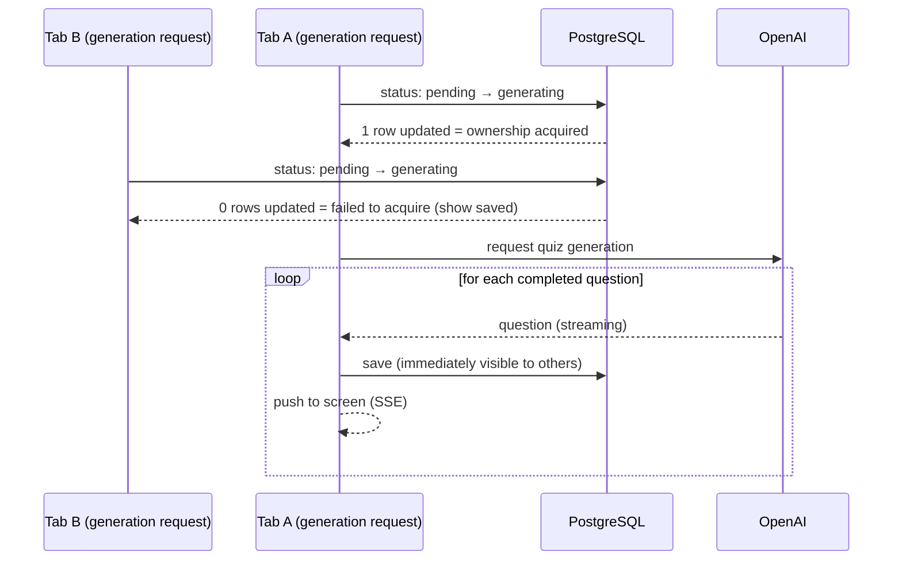

<h1 align="center">Quriosity</h1>

<p align="center"><a href="./README.md">日本語</a> ・ <strong>English</strong></p>

<a href="https://ai-quiz-app-omega.vercel.app/login">🔗 Live Demo (try the demo app)</a>

<p align="center">
  
</p>

---

**_"You studied hard, yet before you know it, it's gone."_** Quriosity is a learning web app built to fix exactly that — turn anything you're curious about into a quiz and review it until it sticks.

Enter any topic and the AI generates a quiz: **answer → instant feedback → results → review**, an end-to-end learning flow.

---

## Features

- **AI quiz generation** — enter a topic and the AI produces questions, options, and explanations
- **Streaming display** — questions appear as soon as each one is ready, without waiting for all of them
- **Answer** → instant feedback on a wrong answer, so you see each result on the spot
- **Result summary** — score and the questions you missed, shown on completion
- **Review** — a spaced-repetition review flow to support long-term retention
- **EN / JA toggle** — switch the UI language (quiz language follows the input text)
- **Auth** — Google login plus a portfolio Demo login

<p align="center">
  
</p>

<br>

## Tech Stack

| Area      | Technology                                              |
| --------- | ------------------------------------------------------- |
| Framework | Next.js 16 (App Router) / React 19 / TypeScript         |
| DB / ORM  | PostgreSQL (Supabase) / Prisma 7                        |
| Auth      | Auth.js v5 (Google OAuth, JWT sessions)                 |
| AI        | OpenAI (Vercel AI SDK, structured output + streaming)   |
| UI        | Tailwind CSS v4 / shadcn/ui                             |
| Deploy    | Vercel                                                  |

<br>

## Project Structure

A feature-sliced layout that separates responsibilities per domain. Each `features/<domain>/` is further split by role (below, `quiz` is expanded; other domains follow the same shape).

```
ai-quiz-app/
├── app/                     ← App Router: routing + each screen's Client Component colocated
│   ├── quiz/[sessionId]/    ← quiz-to-result (colocated per screen)
│   └── api/.../generate/    ← SSE Route Handler that calls OpenAI
│
├── features/                ← responsibilities split per domain
│   ├── quiz/                ← one domain's internals (others follow the same shape)
│   │   ├── actions.ts       ← Server Actions (entry point)
│   │   ├── services.ts      ← domain logic
│   │   ├── data.ts          ← auth + authorization + Prisma (DB access)
│   │   ├── validations.ts   ← input Zod schemas
│   │   └── schemas.ts       ← generation-result schemas
│   └── ...                  ← topic / user / review-session / auth, etc.
│
├── components/              ← ui (shadcn) / shared (common UI)
├── lib/                     ← prisma / openai / i18n / constants ...
├── prisma/                  ← schema & migrations
└── auth.ts / proxy.ts       ← Auth.js config & auth guard
```

Flow (topic input → generation → answering → review):

```mermaid
flowchart LR
    U[User] -->|Enter topic| SA[Server Action]
    SA -->|Create Topic / Session / generation event| DB[(PostgreSQL)]
    SA --> Q[Quiz screen]
    Q -->|Request generation (SSE)| API[API Route]
    API --> LLM[OpenAI]
    LLM -->|One question at a time| API
    API -->|Save one at a time| DB
    API -->|Stream in order via SSE| Q
    Q -->|Submit answer| SA2[Server Action]
    SA2 --> DB
    DB -->|Wrong answers, later| RV[Review session]
```

<br>

## Engineering Highlights

### ⚡ Progressive rendering as questions are generated (streaming)

> [!NOTE]
> 🔻 **Problem** — Waiting for all five questions to finish keeps the user waiting a long time before they can even answer the first one.
>
> 🔧 **Decision** — Commit each finished question one by one and render them progressively without waiting for the rest (streamed from the server via SSE).
>
> ⚖️ **Tradeoff** — More complex than handling all questions at once (per-question commit, rendering, and state management are required).

### 🔒 Exclusive control that prevents duplicate generation

> [!NOTE]
> 🔻 **Problem** — A page reload mid-generation or multi-tab use runs generation twice, producing extra near-duplicate questions and saving more than the intended count.
>
> 🔧 **Decision** — For a single generation, only the first request becomes the owner, enforced at the database.
>
> ⚖️ **Tradeoff** — If you open the same quiz in two tabs at once, the non-owner screen only shows the questions saved so far; the rest are fetched on reload (accepted, since it happens rarely).

<details>
<summary>Technical details</summary>



Several approaches were tried along the way.

- **Rejected approach 1**: Take a row lock (`SELECT ... FOR UPDATE`) on the target row. A row lock only works inside a transaction, and questions aren't committed until that long transaction ends. As a result, saving an answer to a question already pushed to the screen referenced an as-yet-uncommitted question ID and caused a database error (foreign-key violation).
- **Rejected approach 2**: A general lock that spans connections (`pg_advisory_lock`). But it is tied to a connection, and Supabase's transaction pooler returns the connection per transaction, so the next operation runs on a different connection and the lock doesn't hold (keeping it would require a session pooler that occupies the connection, which exhausts connections under serverless) — so it was dropped.
- **Adopted approach**: Drop the long transaction and commit each question in its own small transaction (= immediately visible to others). Exclusivity is achieved with a conditional update: only the request that manages to flip the generation-tracking row from "pending" to "generating" becomes the owner. Because Prisma's update API does this atomically in a single statement, exclusivity holds without hand-building a dedicated lock.

</details>

🔗 Implementation diff → **[PR #150](https://github.com/Yohei-Shiina/ai-quiz-app/pull/150)** (concurrent exclusive control and retry handling). Background requirements: [Issue #109](https://github.com/Yohei-Shiina/ai-quiz-app/issues/109).

### 🎯 Improving quiz quality

> [!NOTE]
> 🔻 **Problem** — A lower-tier model (gpt-5.4-nano) was chosen to cut cost, but reaching the desired quality required a large amount of prompting, and even then the model's ceiling made the goal unreachable.
>
> 🔧 **Decision** — Promoted to a higher-tier model (gpt-5.4-mini), improving quality substantially with its raw ability. Its output was then fed to an even stronger model to analyze it and generate/add refinement prompts, repeated a few times to raise quality further.
>
> ⚖️ **Tradeoff** — About 3× the cost. Accepted, since the per-generation unit cost is small.

<br>

## Tests

A two-tier setup with Vitest.

- **Unit tests** — pure logic: schema validation, input validation, review-schedule calculation, option shuffling, and so on.
- **Integration tests** — run against a real PostgreSQL (Docker). For the exclusive control above, they verify that out of 10 concurrent generation requests, **only 1 actually generates**.

<br>

## Setup

Local setup steps are omitted since this is a public portfolio release. See the **Live Demo** for the running app.

**🔗 Live Demo:** https://ai-quiz-app-omega.vercel.app/login
