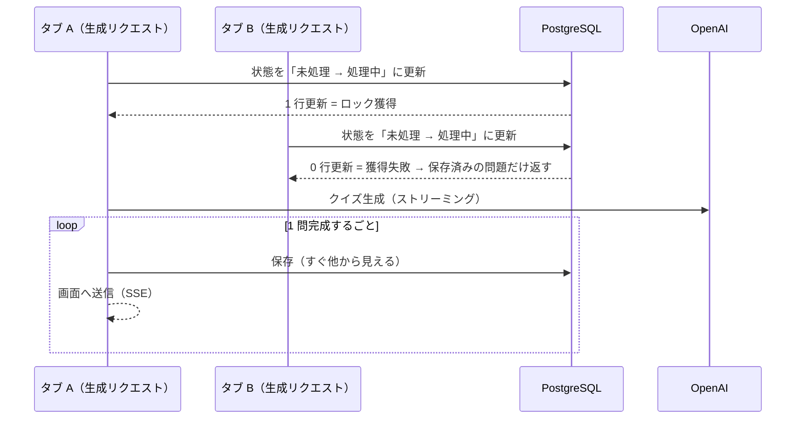

# Quriosity

> 任意のトピックを入力すると AI がクイズを生成し、**回答 → 即時フィードバック → 結果 → 復習**まで一気通貫で学習できる Web アプリ。

「気になり学んだことを気づいたら忘れている」そんなもったいないを防ぐために、気になる内容をクイズにして繰り返し復習できるようにした学習ツールです。

**① トピックを入力 → クイズ生成 → 回答**

https://github.com/user-attachments/assets/e2fd4081-aac2-4349-b576-dc2dac389825

**② 結果 → 復習**

https://github.com/user-attachments/assets/dc826dde-1263-43d4-acb9-e48ea1d50337

**🔗 Live Demo:** https://ai-quiz-app-omega.vercel.app/login
（トップページの **デモログイン** からお試し可能です。デモ用の資格情報は開発者に確認してください。）

---

## 主な機能

- **AI クイズ生成** — トピックを入力すると AI が問題・選択肢・正誤を生成（入力した言語に合わせて生成）
- **ストリーミング表示** — 全ての問題の生成完了を待たず、準備ができた問題から順次表示
- **1問ずつ回答 → 誤答時に即フィードバック** — 各問の正誤をその場で確認
- **結果サマリ** — 完了後にスコアを間違えた問題を表示
- **復習** — 間違えた問題を後から復習セッションで解き直し（簡易版 Spaced Repetition を導入）
- **EN / JA 切替** — UI の表示言語を切り替え（クイズの生成言語は入力テキストに追従）
- **認証** — Google ログイン ＋ ポートフォリオ用 Demo ログイン

---

## 技術スタック

| 領域      | 採用技術                                             |
| --------- | ---------------------------------------------------- |
| Framework | Next.js 16（App Router）/ React 19 / TypeScript      |
| DB / ORM  | PostgreSQL（Supabase）/ Prisma 7                     |
| 認証      | Auth.js v5（Google OAuth・JWT セッション）           |
| AI        | OpenAI（Vercel AI SDK・構造化出力 + ストリーミング） |
| UI        | Tailwind CSS 4 / shadcn/ui                           |
| Deploy    | Vercel                                               |

---

## プロジェクト構成

`features/<domain>/` 配下を `data.ts`（DB アクセス）/ `services.ts`（ドメインロジック）/ `actions.ts`（Server Actions）/ `validations.ts` / `schemas.ts` に分離する Feature-sliced 構成。

```
app/          … ルーティング（App Router）・各ページの view
features/     … ドメインごとのロジック（quiz / topic / review-session / auth ...）
lib/          … 横断ユーティリティ（prisma / openai / i18n ...）
prisma/       … スキーマ・マイグレーション
```

---

## 技術的に工夫した点

### 🔒 クイズの二重生成を防ぐ排他制御

> [!NOTE]
> 🔻 **Problem** — ページリロードや複数タブの同時操作で生成処理が重複して走り、似た問題が余分に生成され、想定した問題数を超えて保存される。
>
> 🔧 **Decision** — 1 回の生成につき最初のリクエストだけが処理するようデータベースで排他制御。問題は 1 問ずつ確定し、全問の完成を待たず順次表示する。
>
> ⚖️ **Tradeoff** — 同じクイズを別タブなどで同時に 2 つ開くと、生成を担当しない側の画面には、その時点で保存済みの問題までしか表示されない。残りは再読み込みで取得する（発生頻度が低いため割り切り）。

<details>
<summary>技術的な詳細を見る</summary>



- **排他制御（CAS）の方式**：PostgreSQL の汎用ロック機能（`pg_advisory_lock`）は「DB への接続」に紐づく。しかし接続を使い回すコネクションプール（Supabase の接続プーラ）では、ロックを取った接続とその後の処理を行う接続が一致せず、排他が効かない。そこで、1 回の生成を管理するレコード（未処理／処理中などの状態を持つ）の状態を「未処理 → 処理中」へ更新できたリクエストだけが処理を担当する方式にした（更新できた＝ロック獲得）。更新は 1 つの命令で完結し、その行のロックも即座に解放されるため、接続を使い回す環境でも安全に排他できる。
- **1 問ずつ保存する理由**：5 問を 1 回の処理でまとめて保存する案は、全部の保存が終わるまで途中の問題が他の処理から見えず、先に回答し終えたユーザーの送信が DB エラーになったため不採用。

</details>

🔗 実装の差分 → **[PR #150](https://github.com/Yohei-Shiina/ai-quiz-app/pull/150)**（同時実行の排他制御と再試行への対応）。背景の要件は [Issue #109](https://github.com/Yohei-Shiina/ai-quiz-app/issues/109)。

### 🎯 品質はプロンプトよりモデル選びで解決

> [!NOTE]
> 🔻 **Problem** — 自明な誤答・言い回しだけ変えた重複・出力言語のブレなど、クイズの品質がプロンプト改善だけでは頭打ちになった。
>
> 🔧 **Decision** — プロンプトの作り込みをやめ、上位モデルへ移行。品質が大きく改善し、旧モデル向けの品質制御プロンプトの大半も不要になった。
>
> ⚖️ **Tradeoff** — 推論コストは約 3 倍。ただし絶対額は小さく、アプリの核であるクイズの品質とプロンプトの保守性を優先した。

---

## セットアップ

ポートフォリオ用の公開のため、ローカル環境構築の手順は省略しています。動作は **Live Demo** からご確認ください。

**🔗 Live Demo:** https://ai-quiz-app-omega.vercel.app/login
（トップページの **デモログイン** からお試し可能です。デモ用の資格情報は開発者に確認してください。）

---

<!-- EN 版は JP 確定後に追加予定 -->
