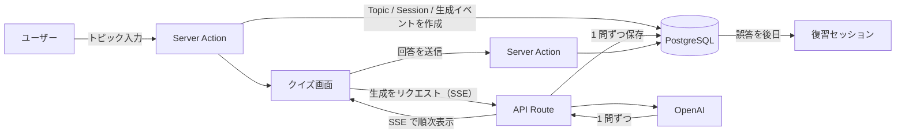
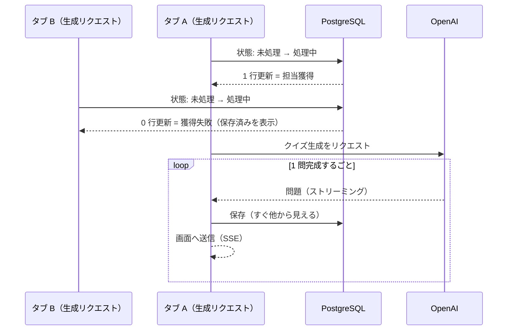

<h1 align="center">
  Quriosity<br>
  <sub><a href="https://ai-quiz-app-omega.vercel.app/login">🔗 Live Demo（実際に動くアプリを試す）</a></sub>
</h1>

<p align="center">
  
</p>

---

**_「せっかく学んだのに、気づいたら忘れている」_** そんな課題を解決するために、気になる内容からクイズを作成し繰り返し復習できるようにした学習 Web アプリ。

AI がクイズを生成 → 回答 → 即時フィードバック → 結果 → 復習 まで一気通貫で学習できます。

---

## 主な機能

- **クイズ生成** — トピックを入力すると AI が問題・選択肢・解説を生成
- **ストリーミング表示** — 全問完成を待たず、生成された問題からすぐ表示
- **回答** → 誤答時に即フィードバックし、各問の正誤をその場で確認
- **結果サマリ** — 完了後にスコアと間違えた問題を表示
- **復習** — 分散学習機能による復習で長期記憶を補助
- **EN / JA 切替** — UI の表示言語を切り替え（クイズの生成言語は入力テキストから判断）
- **認証** — Google ログイン ＋ ポートフォリオ用 Demo ログイン

<p align="center">
  
</p>

<br>

## 技術スタック

| 領域      | 採用技術                                             |
| --------- | ---------------------------------------------------- |
| Framework | Next.js 16（App Router）/ React 19 / TypeScript      |
| DB / ORM  | PostgreSQL（Supabase）/ Prisma 7                     |
| 認証      | Auth.js v5（Google OAuth・JWT セッション）           |
| AI        | OpenAI（Vercel AI SDK・構造化出力 + ストリーミング） |
| UI        | Tailwind CSS v4 / shadcn/ui                          |
| Deploy    | Vercel                                               |

<br>

## プロジェクト構成

ドメインごとに責務を分離する Feature-sliced 構成。`features/<domain>/` 内をさらに役割で分割している（下は `quiz` を展開。他ドメインも同じ型）。

```
ai-quiz-app/
├── app/                     ← App Router：ルーティング＋各画面の Client Component を近接配置
│   ├── quiz/[sessionId]/    ← 出題〜結果（画面ごとに colocation）
│   └── api/.../generate/    ← OpenAI を呼ぶ SSE Route Handler
│
├── features/                ← ドメイン別に責務を分離
│   ├── quiz/                ← 1 ドメインの内訳（他も同じ型）
│   │   ├── actions.ts       ← Server Actions（入口）
│   │   ├── services.ts      ← ドメインロジック
│   │   ├── data.ts          ← 認証・認可＋Prisma（DB アクセス）
│   │   ├── validations.ts   ← 入力の Zod スキーマ
│   │   └── schemas.ts       ← 生成結果スキーマ
│   └── ...                  ← topic / user / review-session / auth ほか
│
├── components/              ← ui（shadcn）/ shared（共通 UI）
├── lib/                     ← prisma / openai / i18n / constants ...
├── prisma/                  ← schema・migrations
└── auth.ts / proxy.ts       ← Auth.js 設定・認証ガード
```

処理の流れ（トピック入力 → 生成 → 回答 → 復習）：



<br>

## 技術的に工夫した点

### ⚡ 生成した問題から順次表示（ストリーミング）

> [!NOTE]
> 🔻 **Problem** — 全問（5 問）の生成完了を待つと、最初の 1 問に回答できるまでユーザーを長く待たせる。
>
> 🔧 **Decision** — 完成した問題から 1 問ずつ確定し、全問の完成を待たずに順次画面へ表示（サーバーから SSE でストリーミング）。
>
> ⚖️ **Tradeoff** — 全問を一括で扱う場合より実装が複雑になる（1 問ずつの確定・表示・状態管理が必要）。

### 🔒 クイズの二重生成を防ぐ排他制御

> [!NOTE]
> 🔻 **Problem** — 生成中のページリロードや複数タブ操作で生成処理が重複して走り、似た問題が余分に生成され、想定した問題数を超えて保存される。
>
> 🔧 **Decision** — 1 回の生成につき最初のリクエストだけが担当するようデータベースで排他制御する。
>
> ⚖️ **Tradeoff** — 同じクイズを別タブなどで同時に 2 つ開くと、生成を担当しない側の画面には、その時点で保存済みの問題までしか表示されない。残りは再読み込みで取得する（発生頻度が低いため割り切り）。

<details>
<summary>技術的な詳細を見る</summary>



ここに至るまでにいくつか試した。

- **不採用案 1**：生成対象の行に排他ロック（`SELECT ... FOR UPDATE`）をかける方式。行ロックはトランザクション内でしか使えず、その長いトランザクションが終わるまで問題が確定（コミット）されない。すると先に画面へ送った問題への回答の保存が、まだコミットされていない問題の ID を参照してデータベースエラー（外部キー違反）になった。
- **不採用案 2**：接続をまたげる汎用ロック（`pg_advisory_lock`）。ただし接続に紐づく仕組みで、トランザクションごとに接続を返す Supabase の transaction pooler では次の処理が別接続になり効かない（維持するには接続を占有する session pooler が要るが、サーバレスでは接続を枯渇させる）ため見送り。
- **採用案**：長いトランザクションをやめ、問題を 1 問ずつ小さなトランザクションで確定（＝すぐ他から見える）。重複の排他は、生成を管理する 1 行を「未処理 → 処理中」へ更新できたリクエストだけが担当する条件付きの更新で実現。この更新は Prisma の更新 API が 1 命令で原子的に行うため、専用のロック機構を自作せずに排他が成立する。

</details>

🔗 実装の差分 → **[PR #150](https://github.com/Yohei-Shiina/ai-quiz-app/pull/150)**（同時実行の排他制御と再試行への対応）。背景の要件は [Issue #109](https://github.com/Yohei-Shiina/ai-quiz-app/issues/109)。

### 🎯 クイズ品質の改善

> [!NOTE]
> 🔻 **Problem** — コスト削減のために下位モデル（gpt-5.4-nano）を選んだが、期待する質を出すにはプロンプトを大幅に増やす必要があり、それでもモデル能力の限界で目的を達成できなかった。
>
> 🔧 **Decision** — 上位モデル（gpt-5.4-mini）へ昇格し、素の能力で質を大幅に改善。さらにその出力をより上位のモデルに渡し、分析と改善プロンプトの生成・追加を数回繰り返して質を高めた。
>
> ⚖️ **Tradeoff** — コストは約 3 倍。ただし 1 回のクイズ生成あたりの単価は小さいため許容した。

<br>

## テスト

Vitest による 2 層構成。

- **ユニットテスト**：スキーマ検証・入力バリデーション・復習スケジュールの計算・選択肢のシャッフルなど、純粋なロジックを対象。
- **統合テスト**：実際の PostgreSQL（Docker）に対して実行。上記の排他制御について、同時に来た 10 件の生成リクエストのうち **実際に生成するのは 1 件だけ** になることを確認。

<br>

## セットアップ

ポートフォリオ用の公開のため、ローカル環境構築の手順は省略しています。動作は **Live Demo** からご確認ください。

**🔗 Live Demo:** https://ai-quiz-app-omega.vercel.app/login

<!-- EN 版は JP 確定後に追加予定 -->
